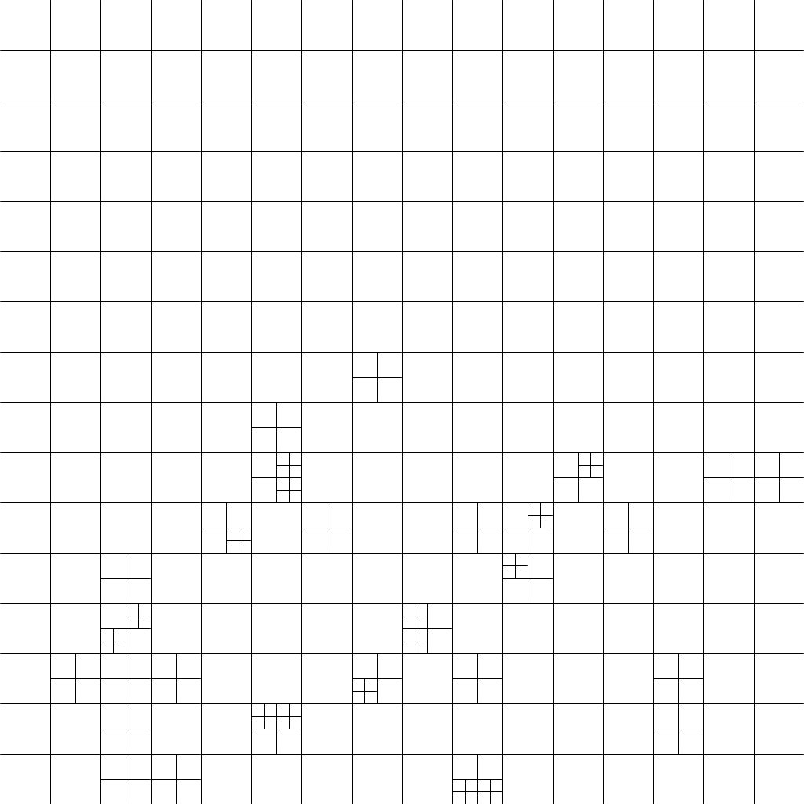
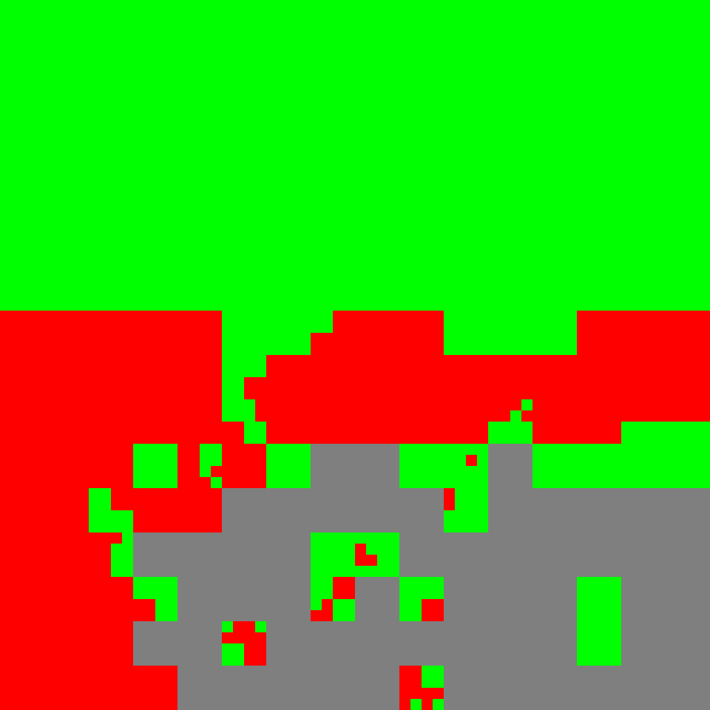

# Segmap Builder 0.1

A aplicação permite construir **mapas semânticos 2D** a partir de imagens, que são representações gráficas de conceitos e suas relações. Para isso, a aplicação utiliza um algoritmo simples de divisão da imagem em quadrantes, baseado na probabilidade de predição do classificador **KNN (K-Nearest Neighbors)**, com **MobileNets**. Tudo isto diretamente no navegador, usando a biblioteca **Tensorflow.js**.

Esta aplicação está disponível gratuitamente no GitHub Pages, em [leo150250.github.io/SegmapBuilder/](https://leo150250.github.io/SegmapBuilder/)

# Como funciona

O **KNN** é um algoritmo de aprendizagem supervisionada que classifica um objeto com base na proximidade com os seus vizinhos mais próximos. O **MobileNets** é uma arquitetura de redes neurais convolucionais otimizada para dispositivos móveis, que usa camadas separáveis por profundidade para reduzir o número de parâmetros e o custo computacional.

Ambos possuem modelos disponíveis com a biblioteca **Tensorflow.js**, que permite trazer modelos de Machine Learning para JavaScript, diretamente no navegador ou em Node.js.

Por utilizar um classificador KNN para cumprir seu propósito, o **Segmap Builder** está mais apto a detectar conceitos em imagens que retratam superfícies. Assim, a aplicação requer apenas pequenas imagens de amostra para a correta rotulação da imagem, podendo ainda serem de tamanhos diferentes da resolução da imagem a ser mapeada, mas ainda conter apenas um conceito por imagem.

## Exemplo:

Vamos supor que iremos analisar esta imagem:

Para ela, precisaremos de pelo menos três imagens de amostra, sendo elas:
|           | Label 1   | Label 2   | Label 3     |
|-----------|-----------|-----------|-------------|
|**Nome**   | grama     | tijolo    | concreto    |
|**Cor**    | 0 255 0   | 255 0 0   | 127 127 127 |
|**Tamanho**| 128 x 128 | 128 x 128 | 256 x 256   |
|**Imagem** |  |  |  |

Durante o processamento, a aplicação divide a imagem em *quadrantes* e aplica o classificador KNN com MobileNets para cada quadrante, usando as imagens de amostra como referência. Caso a probabilidade da predição esteja acima do limiar que o usuário definiu, a aplicação pinta aquele quadrante com a cor do conceito identificado. Caso contrário, o quadrante é dividido em outros quadrantes, para realizar uma detecção mais precisa em cada ponto da imagem, até que todos os quadrantes sejam corretamente identificados ou contemplem o tamanho mínimo.

Neste exemplo, foi definido para que o tamanho máximo fosse 64x64, e o tamanho mínimo fosse 16x16.

O resultado é um mapa semântico 2D que mostra os conceitos presentes na imagem e suas localizações. A aplicação também atribui uma cor diferente para cada conceito, facilitando a visualização do mapa. As imagens devidamente mapeadas podem posteriormente ser baixadas para montar um dataset, a fim de ser utilizado para treinamento de IAs de forma rápida e fácil, sem precisar de ferramentas externas ou muitos dados de treinamento.

O uso correto dos conceitos bem como o ajuste das opções da aplicação são fundamentais para que o mapa possa trazer maior fidelidade em relação às possíveis verdades fundamentais, em caso de testes.